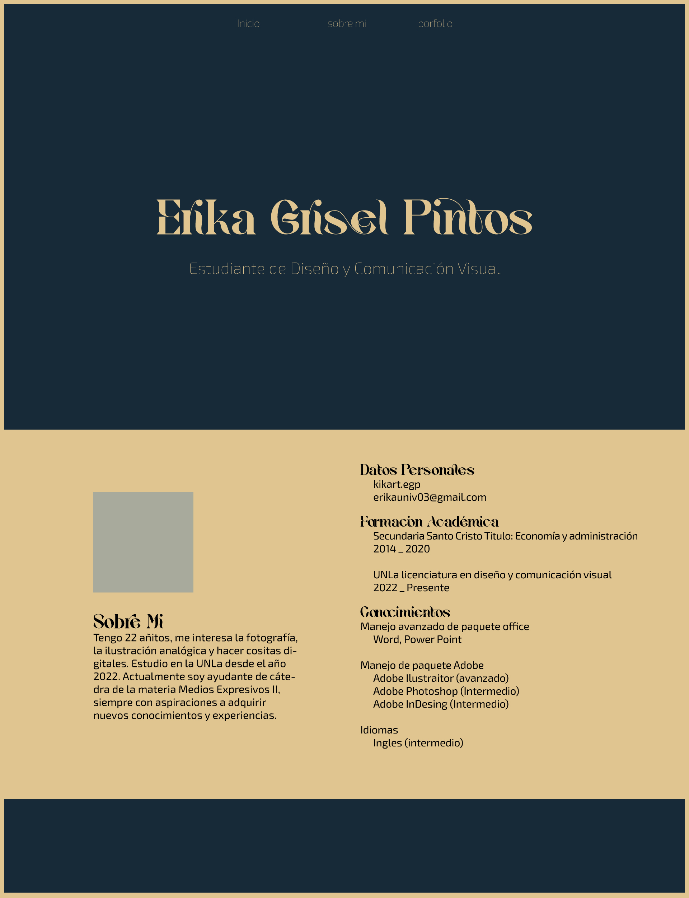

tp1 etiqueta html5

Aplique un head con las herramientas necesarias, dos links, uno para vincular el html al css y otro para aplicar un icon, también aplique un style para importar un url con una tipografía y sus variables desde google fonts, asi mismo en css también agregue otra tipografía display con font-face.
En el sector del body, incluí un header, donde contiene un link de navegación con 3a espaciados con flexbox. También un main donde a primera vista se visualiza primero un background de color con un H1 con mi nombre y un H2 con mi profesión, por debajo dos bloques divididos por secciones y aplicando flexbox en columnas, por un lado la sección "ladofoto" donde contiene una imagen e información sobre mi, recubierto con un borde y por otro lado otra sección llamada "datosgenerales" que contiene un listado de informaciones generales, como formación académica y mis conocimientos. Por ultimo un footer con el mismo background de color que en el header y parte del main, también dividido en dos secciones y aplicando fleblox, donde de un lado salen dos p con el nombre de la catedra y mi gmail y del otro 4 links de navegaciones con iconos con logos de redes sociales las cuales contienen cada una un href que te llevan a mis redes.
Aca dejo un boceto de como quería que se vea de base y con lo que me inspire para empezar, a lo largo de la realización del código fui editando algunas cosas para que visualmente quede mejor.
Resolución de pantalla: 1366 x 768

